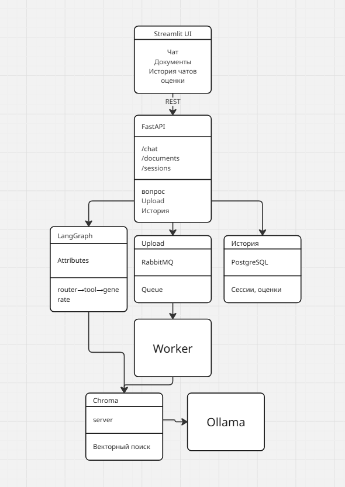

# Corporate AI Assistant (RAG + Agents)

AI-агент для работы с внутренней базой знаний компании: пользователь загружает
документы, задаёт вопросы, агент ищет релевантный контекст через RAG, отвечает с
опорой на источники, при необходимости вызывает инструменты и сохраняет историю.


## Стек

Backend: Python 3.11+, FastAPI, Pydantic. LLM/Agents: LangChain, LangGraph,
Ollama (OpenAI-совместимый API). RAG: Chroma, nomic-embed-text. Хранилище:
PostgreSQL. Очереди: RabbitMQ. UI: Streamlit. DevOps: Docker Compose.

## Архитектура





Поток вопроса: UI → FastAPI → LangGraph-агент (router решает search/direct) →
tool `search_documents` → Chroma → LLM генерирует ответ по контексту → ответ с
источниками + запись хода в PostgreSQL.

Поток загрузки: UI → FastAPI сохраняет файл и ставит задачу в RabbitMQ → Worker
извлекает текст, чанкует, считает эмбеддинги и пишет в Chroma → статус документа
обновляется в PostgreSQL.


## Roadmap (production-улучшения)

- Alembic-миграции вместо `create_all`
- Фильтрация retrieval по `document_id` (выбор документа в UI)
- Роли пользователей и аутентификация
- Dead-letter очередь и ретраи для worker
- Helm chart, Kubernetes manifests, Jenkinsfile, ArgoCD


## Kubernetes

Манифесты для деплоя в кластер лежат в папке `k8s/` (namespace `corpai`):
ConfigMap и Secret, StatefulSet для PostgreSQL, Deployment'ы для RabbitMQ, Chroma,
backend, worker и frontend, общий PVC для загруженных файлов и опциональный
Ingress. Backend и worker используют один образ, отличаясь командой запуска;
worker масштабируется независимо (`kubectl scale`).

Ollama остаётся вне кластера — её адрес задаётся в `k8s/01-config.yaml`
(внешний OpenAI-совместимый эндпоинт или IP хоста).

Быстрый старт (kind/minikube):

```bash
docker build -t corpai-backend:latest ./backend
docker build -t corpai-frontend:latest ./frontend
kind load docker-image corpai-backend:latest corpai-frontend:latest

kubectl apply -f k8s/
kubectl -n corpai get pods -w
kubectl -n corpai port-forward svc/frontend 8501:8501   # → http://localhost:8501
```

Подробности и нюансы (загрузка образов, RWX-том, версия Chroma) — в `k8s/README.md`.